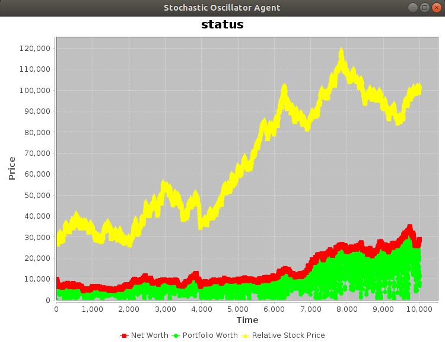
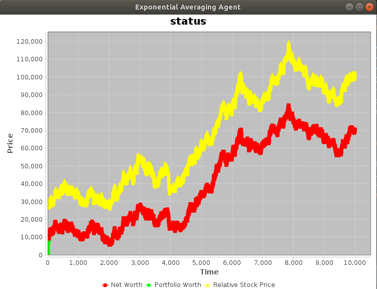
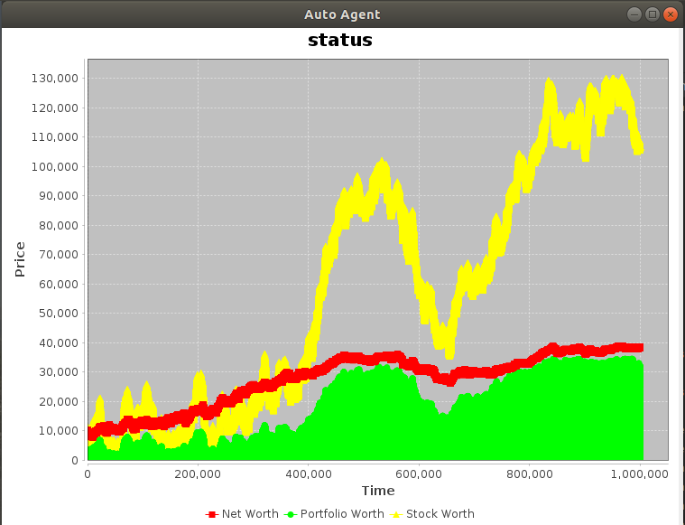
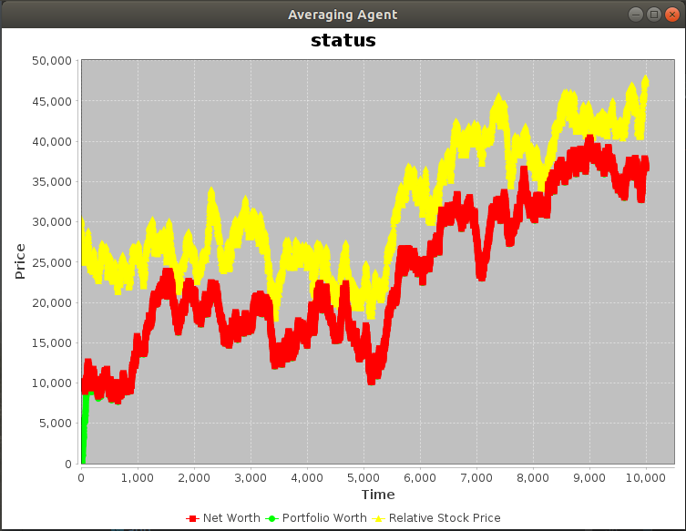
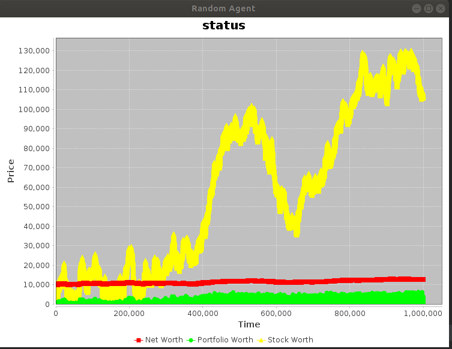

# Autonomous Stock-Trading Agent $$ Cha-Ching $$
> autonomous agents that analyze stock trends and trade intelligently in a simulated virtual stock market 

> new features currently in development. More agents and Market types comming :))

## Table of Contents
- [Dependencies](#dependencies)
- [Running the App](#usage)
- [Agent Descriptions](#agents)
- [Market Descriptions](#markets)

### Dependencies
> jfreechart-1.5.0

> commons-math3-3.6.1

all the external libraries above can be found at `src/main/resources`

### Usage
run `app.java` found at `src/main/java/`

Change the agent types and market types at the top of `app.java` to use different agents and markets

### Agents
The Agents take in information from the market, and decide on what to buy and how much to buy. 

Its main goal is to maximize its net worth, which is the sum of its current balance and its portfolio worth. 

The following types of agents are provided in this project: 

1. **Stochastic Oscillator Agent**:
The Agent uses the stochastic oscillator indicator to check on overbought and oversold signals, and to decide when and how much to buy and sell

2. **Exponential Moving Average Agent**:
The Agent uses the EMA indicator to predict stock trends and to decide buying and selling

3. **Auto Agent**:
The Auto agent looks at a sequence of the stock market past prices, and tries to buy low and sell high.
It tries to predict the low and high points in the market using linear regression.

4.  **Averaging Agent**:
The Averaging agent also tries to buy low and sell high, but instead uses the ["moving average"](https://www.investopedia.com/articles/active-trading/052014/how-use-moving-average-buy-stocks.asp) technique to determine the time for buying and selling.

5. **Random Agent**: 
The Agent buys and sells stock randomly, within its budget

### Stocks 
There are several kinds of stocks 

1. **Real Stocks**:
These are real company stock's history data, such as Google's stock, parsed from [Yahoo Finance](https://finance.yahoo.com/). 

2. **Simulated Random Stock**:
There are purely simulated stocks that fluctuates randomly, either uniformly or according to a normal distribution.

3. **Simulated Cyclical Stock**:
Simulate stocks that imitates real world stocks that have trends and cycles. 

### Markets
The Market holds a list of different stocks, each fluctuating with time. 

The follwoing types of stock markets are provided:

1. **Naive Market**:
A simple market that only keeps track of how much stock are bought and sold, only keeps track of daily closing price, and assumes that the amount of buying and selling has no impact on stock price.
